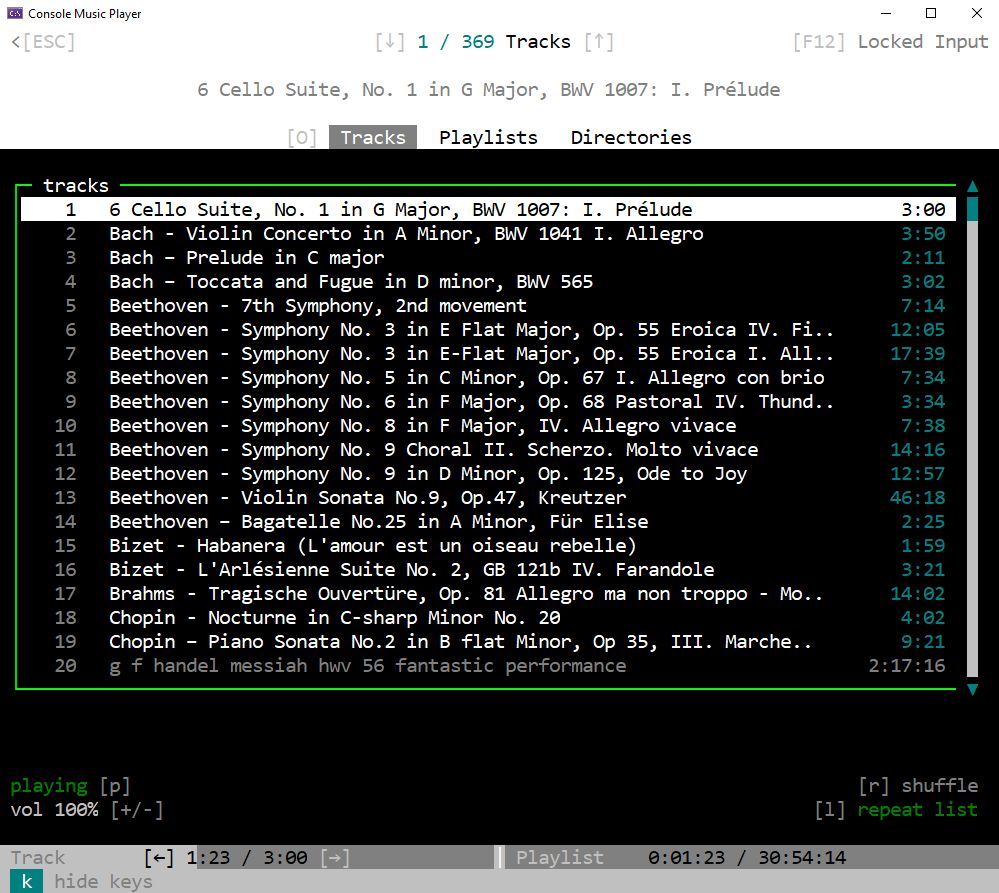

# ConsoleMusicPlayer
<br>
<p align="center">
 <br>
</p>
This music player uses as interface a console and can run playlists. Used is the SDL2 audio system.

## Installation
This program supports Windows (x86, x64). Just download, open Visual Studio, put SDL2 .dlls to your executable, compile and run. 

## How to use this music player?
After you started the program and all tracks are loaded, you are in 'Tracks' state where you can scroll (with your mouse wheel) through the list of found tracks on your system (make sure console is on focus). If you want to play the currently highlighted track just press Enter. On the bottom you can see the status of the currently playing track and there are options to skip a few seconds forward / backward or jump to the track before / after the current one, to loop, change volume, to shuffle and pause.
In the navigation bar on the top you have three options: Tracks (selected by default), Playlists and Directories. "Directories" just lists all the directories where the program is searching for music. Under Playlists you can choose a playlist and see all its tracks. Start the playlist by selecting a track in the playlist (Enter key) or press 'B' to go back to the playlist selection. Tracks are searched for in specific folders specified in config.properties.
Enjoy!
#### Create playlists!
If you like, you can add a playlist to data/. In a playlist (.pl) file in each line is the filename (e.g. myMusic.mp3) of a music file (which has to be in an folder specified in config.properties::musicDirs). Note: PlaylistEditor is comming, but for now dirToPlaylist.py helps to somewhat create playlists:

```powershell
PS D:\...\Console_MusicPlayer> python dirToPlaylist.py "C:\Users\MyName\Musik"
```

This will output an \<dir-name\>.pl file to your current directory which contains all tracks who are directly inside this directory. 

## How does it look?
### Tracks


### Playlists


### Playlists > Playlist


### Directories


## Known issues
- Resizing the console can cause issues.
- Scroll wheel and duration bar are a bit off.

## What is done next?
- I want to add an PlaylistEditor (add, remove music from a playlist and create new ones and specify directories).
- Search bar