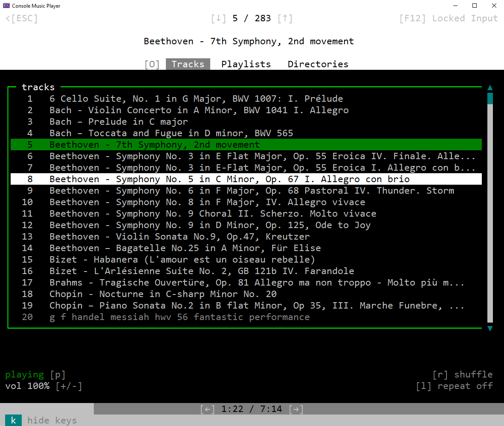

# ConsoleMusicPlayer
<br>
<p align="center">
 <br>
</p>
This music player uses as interface a console and can run playlists. Used is the SDL2 audio system.

## Installation
This program supports Windows (x86, x64). Just download, open Visual Studio, put SDL2 .dlls to your executable, compile and run. 

## How to use this music player?
After you started the program and all tracks are loaded, you are in 'Menu > Tracks' where you can scroll (with your mouse wheel) through the list of found tracks on your system. If you want to play the currently highlighted track just press Enter. On the bottom you can see the some status to the currently running track and there are options to skip a few seconds forward or jump to the track after or before the current one.
In the menu you have on the top three options: Tracks (selected by default), Playlists and Directories. "Directories" just lists all the directories where the program is searching for music. Under Playlists you can choose a playlist which brings one to the playlist player in which one has additional info and options on each music and of course only a the selected amount of music is processed (press 'B' to go back to the menu). By default there is a 'all' playlist which plays all music.
Tracks are searched for in specific folders specified in config.dat.
Enjoy!
#### Create playlists!
If you like, you can add a playlist to data/. In a playlist (.pl) file in each line is the filename (e.g. myMusic.mp3) of a music file (which has to be in an folder specified in config.dat::musicDirs). Note: PlaylistEditor is comming, but for now dirToPlaylist.py helps to somewhat create playlists:

```powershell
PS D:\...\Console_MusicPlayer> python dirToPlaylist.py "C:\Users\MyName\Musik"
```

This will output an \<dir-name\>.pl file to your current directory which contains all tracks who are directly inside this directory. 

## How does it look?
### Menu > Tracks


## Known issues
- Resizing the console can cause issues (horizontal resizing should be fine, though).

## What is done next?
- I want to add an PlaylistEditor (add, remove music from a playlist and create new ones and specify directories).
- Search bar